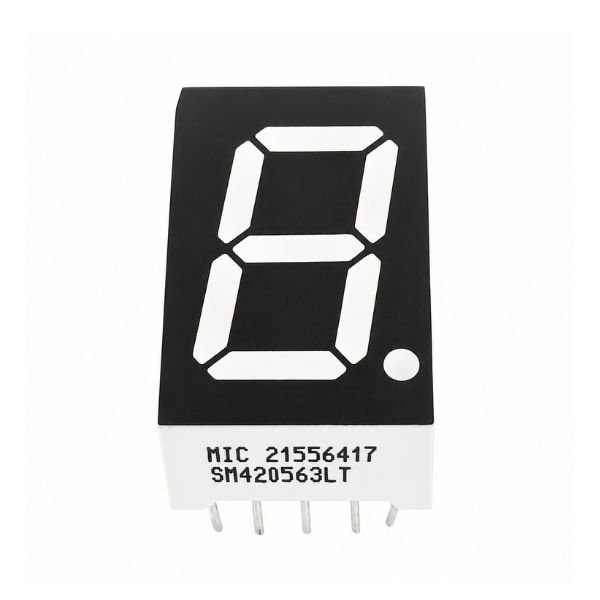
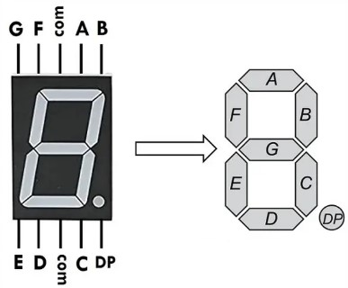
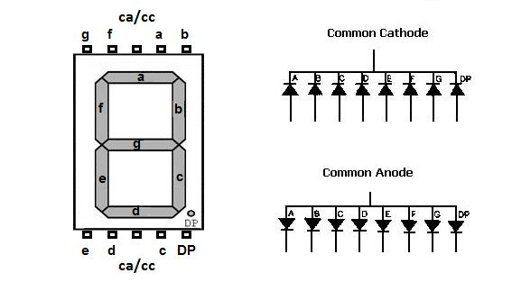
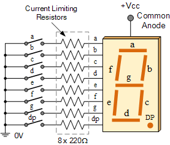
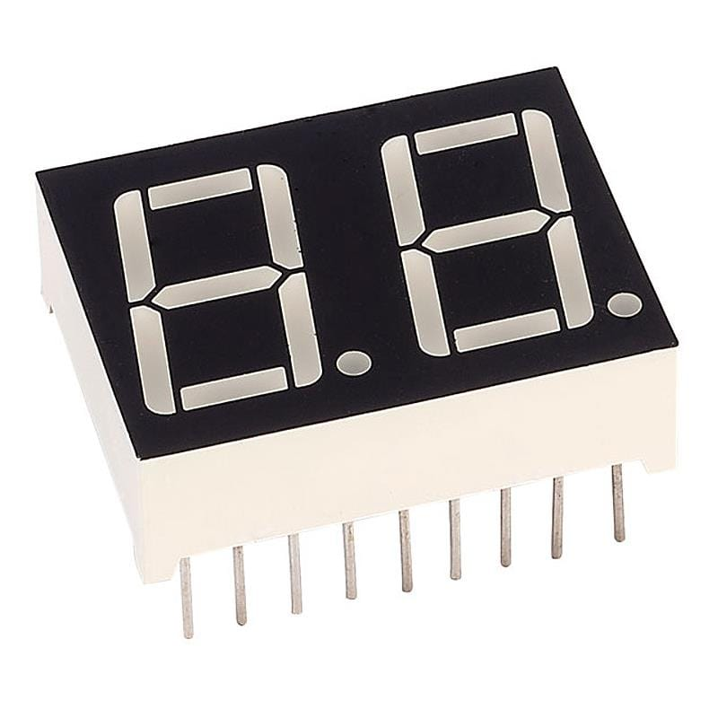
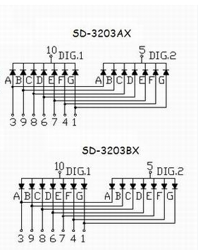

# Sedmisegmentový LED displej

Sedmisegmentový displej je elektronická zobrazovací součástka určená především k zobrazování číslic **0 až 9**. Obsahuje sedm LED segmentů označených **a až g** a často také desetinnou tečku **DP**. Rozsvícením vhodné kombinace segmentů vznikne požadovaná číslice.

## Jednociferný sedmisegmentový displej

Jednotlivé segmenty jsou samostatné LED diody. Každý segment se ovládá vlastním vývodem a musí být zapojen přes **omezovací rezistor**, aby nedošlo k poškození LED.

## Společná katoda a společná anoda

| Provedení | Společný vývod | Rozsvícení segmentu |
|---|---|---|
| **Společná katoda (CC)** | Katody všech LED jsou spojeny a připojují se k **GND**. | Na příslušnou anodu segmentu se přivede kladné napětí – logická **1**. |
| **Společná anoda (CA)** | Anody všech LED jsou spojeny a připojují se k **+V**. | Příslušná katoda segmentu se stáhne k zemi – logická **0**. |

> Konkrétní rozmístění vývodů se může lišit podle výrobce. Před zapojením je nutné zkontrolovat katalogový list daného displeje.

## Dvouciferný sedmisegmentový displej

