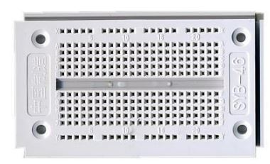
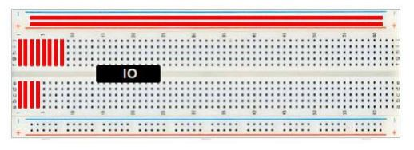
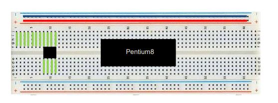
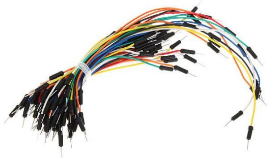
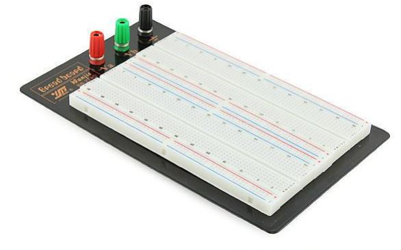
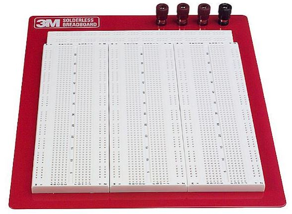
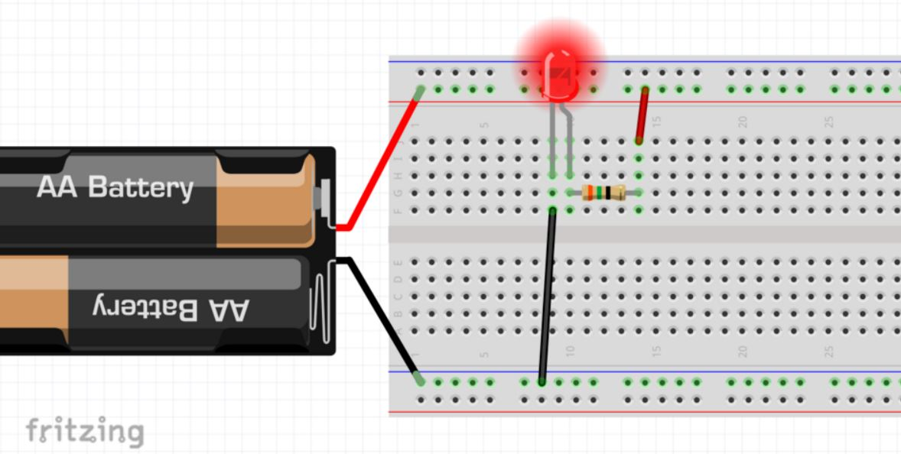
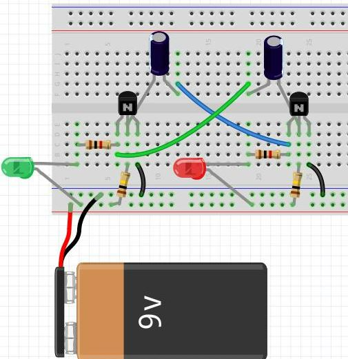
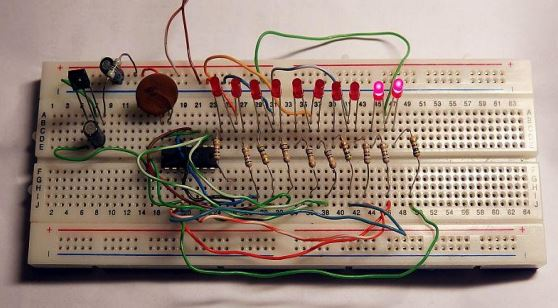

# Základy práce s nepájivým kontaktním polem (breadboard)

Nepájivé kontaktní pole, často označované jako **breadboard**, slouží k rychlému sestavování a zkoušení elektronických obvodů bez pájení. Součástky a propojovací drátky se jednoduše zasunují do otvorů.

## Jak jsou otvory propojené

Otvory breadboardu nejsou všechny samostatné. Pod plastovým povrchem jsou kovové kontakty, které spojují určité skupiny otvorů.

- Na pracovní ploše bývá propojeno vždy **pět otvorů v jedné skupině**.
- Středová mezera rozděluje pracovní plochu na dvě oddělené poloviny.
- Dlouhé napájecí lišty označené `+` a `−` slouží k rozvodu napětí.
- Napájecí lišta může být u některých polí uprostřed přerušená. Propojení je proto vhodné zkontrolovat multimetrem.

## Propojovací drátky

Jednotlivé části obvodu se propojují **propojovacími drátky**, často nazývanými také jumper wires. Kovové konce drátků se zasunují přímo do otvorů breadboardu.

## Běžné typy breadboardů

### Malé kontaktní pole

### Standardní pole s napájecími lištami

### Velké laboratorní pole

## Jednoduchý příklad zapojení

