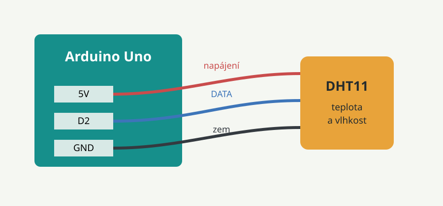
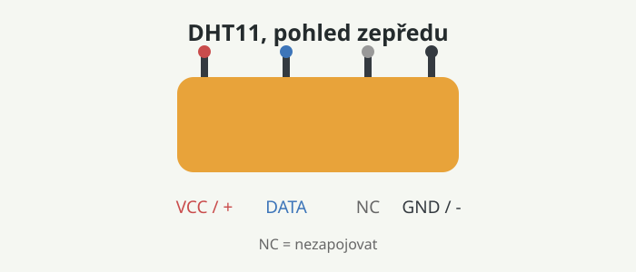

# Arduino a senzor DHT11

V tomto návodu připojíme senzor DHT11 k Arduinu Uno a zobrazíme naměřenou teplotu a vlhkost v sériovém monitoru.

## Co potřebujeme

- Arduino Uno
- senzor DHT11
- rezistor $10\ k\Omega$ (u samostatného čtyřpinového senzoru)
- nepájivé kontaktní pole
- propojovací vodiče
- USB kabel



## Zapojení

U modulu DHT11 se třemi piny bývá rezistor již připojený. U samotného čtyřpinového senzoru zapojte mezi pin **VCC** a **DATA** rezistor $10\ k\Omega$.

| DHT11 | Arduino Uno |
| --- | --- |
| VCC (+) | 5V |
| DATA | digitální pin 2 |
| GND (-) | GND |



Před zapojením odpojte Arduino od USB. Zkontrolujte, že napájení **VCC** vede na **5V** a zem **GND** na **GND**. Přepólování může senzor poškodit.

## Instalace knihoven

1. Otevřete Arduino IDE.
2. Vyberte **Nástroje > Spravovat knihovny**.
3. Vyhledejte knihovnu **DHT sensor library** od Adafruit a klikněte na **Instalovat**.
4. Pokud se Arduino IDE zeptá na další potřebnou knihovnu, potvrďte její instalaci.

## Program

Vytvořte nový program a vložte tento kód:

```cpp
#include <DHT.h>

const int dhtPin = 2;
const int dhtType = DHT11;
DHT dht(dhtPin, dhtType);

void setup() {
	Serial.begin(9600);
	dht.begin();
}

void loop() {
	float humidity = dht.readHumidity();
	float temperature = dht.readTemperature();

	if (isnan(humidity) || isnan(temperature)) {
		Serial.println("Chyba pri cteni senzoru DHT11");
		delay(2000);
		return;
	}

	Serial.print("Teplota: ");
	Serial.print(temperature);
	Serial.println(" °C");

	Serial.print("Vlhkost: ");
	Serial.print(humidity);
	Serial.println(" %");

	delay(2000);
}
```

## Nahrání a čtení hodnot

1. Připojte Arduino k počítači USB kabelem.
2. V nabídce **Nástroje** vyberte desku **Arduino Uno** a správný port.
3. Klikněte na **Nahrát**.
4. Otevřete **Nástroje > Sériový monitor**.
5. Nastavte rychlost komunikace na **9600 baudů**.

Po několika sekundách se zobrazí teplota a relativní vlhkost. DHT11 není určený k rychlému měření, proto program mezi měřeními čeká dvě sekundy.

## Nejčastější problémy

- **Chyba při čtení senzoru:** zkontrolujte vodiče VCC, DATA a GND.
- **Nezobrazuje se výstup:** ověřte, že je v sériovém monitoru nastaveno `9600 baudů`.
- **Hodnoty jsou nesmyslné:** ujistěte se, že program používá `DHT11`, ne `DHT22`.