# Rezistory

**Rezistor je pasivní elektronická součástka**, jejíž hlavní vlastností je **elektrický odpor**. Značka elektrického odporu je a jeho jednotkou je **ohm**, který zapisujeme symbolem .

-   omezuje neboli snižuje elektrický proud,
-   vytváří úbytek napětí,

## Na čem závisí elektrický odpor

Platí vztah:

R = ρ · l / S

kde:

* **R** je elektrický odpor v ohmech [**Ω**],
* **ρ** je měrný elektrický odpor materiálu v [**Ω·m/mm²**],
* **l** je délka vodiče v metrech [**m**],
* **S** je plocha průřezu vodiče v milimetrech čtverečných [**mm²**].

## Schématická značka rezistoru

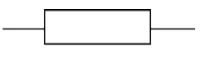

## Rozdělení rezistorů

### 1\. Rezistory s pevnou hodnotou

Jejich odpor je stanoven při výrobě a při běžném používání se nemění.

-   **Drátové rezistory**
-   **Uhlíkové rezistory**
-   **Metalizované rezistory**

### 2\. Rezistory s proměnnou hodnotou

Jejich odpor lze nastavit pohybem jezdce nebo otáčením ovládacího prvku.

-   **Potenciometry**
-   **Trimry**
-   **Reostaty**

## Konstrukce rezistor

Rozměry rezistoru často souvisejí s jeho dovoleným výkonem. Větší výkonové rezistory mohou odvádět více tepla, a proto bývají větší.

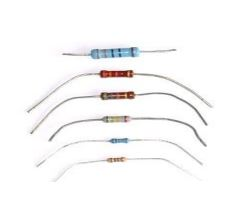

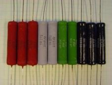

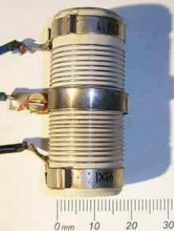

  

## Výrobní řada E12

<table style="width: auto; border-collapse: collapse; text-align: center; margin: 10px 0;">
  <tr>
    <td style="border: 1px solid #ccc; padding: 4px 8px; background: #f9f9f9;">1</td>
    <td style="border: 1px solid #ccc; padding: 4px 8px; background: #f9f9f9;">1,2</td>
    <td style="border: 1px solid #ccc; padding: 4px 8px; background: #f9f9f9;">1,5</td>
    <td style="border: 1px solid #ccc; padding: 4px 8px; background: #f9f9f9;">1,8</td>
    <td style="border: 1px solid #ccc; padding: 4px 8px; background: #f9f9f9;">2,2</td>
    <td style="border: 1px solid #ccc; padding: 4px 8px; background: #f9f9f9;">2,7</td>
    <td style="border: 1px solid #ccc; padding: 4px 8px; background: #f9f9f9;">3,3</td>
    <td style="border: 1px solid #ccc; padding: 4px 8px; background: #f9f9f9;">3,9</td>
    <td style="border: 1px solid #ccc; padding: 4px 8px; background: #f9f9f9;">4,7</td>
    <td style="border: 1px solid #ccc; padding: 4px 8px; background: #f9f9f9;">5,6</td>
    <td style="border: 1px solid #ccc; padding: 4px 8px; background: #f9f9f9;">6,8</td>
    <td style="border: 1px solid #ccc; padding: 4px 8px; background: #f9f9f9;">8,2</td>
  </tr>
</table>

## Barevné značení rezistorů

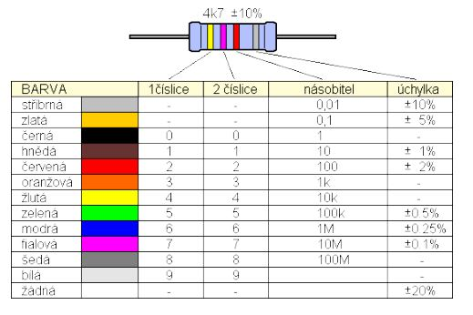

  

## Potenciometr

**Potenciometr je rezistor s plynule proměnným odporem.** Má odporovou dráhu a pohyblivý jezdec.

Potenciometr se používá například:

-   k regulaci hlasitosti,
-   k nastavení jasu,
-   k nastavení napětí,
-   jako snímač polohy,
-   v ovládacích prvcích přístrojů.

  

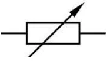

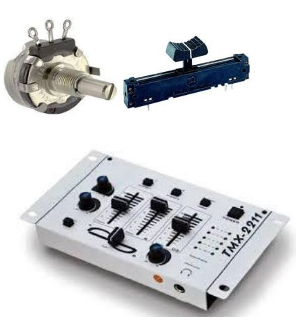

  

## Trimr

  

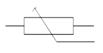

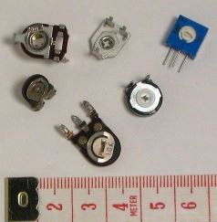

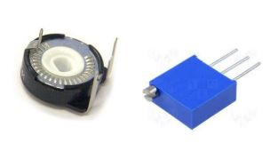

## Aripot  

  

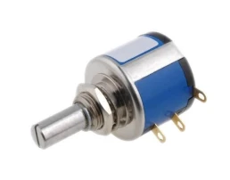

Spojování rezistorů

## Sériové zapojení

Při sériovém zapojení jsou rezistory zapojeny za sebou.

  

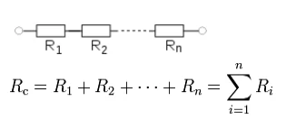

## Paralelní zapojení

Při paralelním zapojení jsou oba konce rezistorů připojeny ke stejným dvěma uzlům.

##   

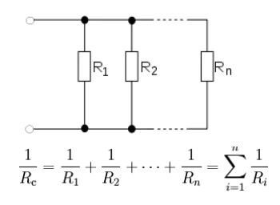