# Diody a LED

## 1\. Obyčejná dioda

Dioda je elektronická polovodičová součástka, která **propouští elektrický proud pouze jedním směrem**. Můžeme si ji jednoduše představit jako jednosměrný ventil pro elektrický proud.

Používá se například:

-   k usměrnění střídavého proudu,
-   k ochraně obvodu před přepólováním,
-   k zabránění průchodu proudu nežádoucím směrem.

### Schematická značka

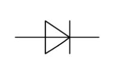

### Jak dioda vypadá

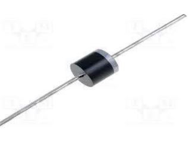
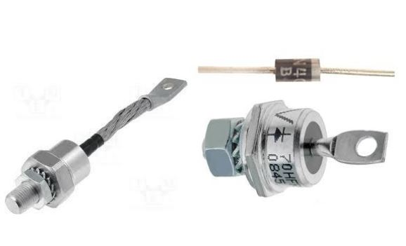

Na pouzdře diody bývá proužek. Tento proužek označuje **katodu**.

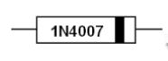

_Černý proužek na pouzdře označuje katodu._

### Vývody diody

-   **Anoda (A)** se při běžném zapojení připojuje k **plusu (+)**.
-   **Katoda (K)** se připojuje k **minusu (−)**.
-   Katodu poznáme podle proužku na pouzdře nebo podle svislé čáry ve schematické značce.

### Propustný směr

Když je anoda připojena k plusu a katoda k minusu, dioda je zapojena v **propustném směru**. Proud prochází a žárovka svítí.

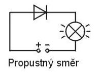

### Závěrný směr

Když zapojení otočíme, dioda je v **závěrném směru**. Proud téměř neprochází a žárovka nesvítí.

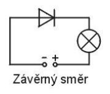

## 2\. LED

LED je dioda, která při průchodu proudu **svítí**. Zkratka LED pochází z anglického názvu _Light Emitting Diode_ – světlo vyzařující dioda.

LED se používají jako kontrolky, displeje, osvětlení a signalizační světla.

### Jak LED vypadají

LED se vyrábějí v různých barvách, velikostech a tvarech.

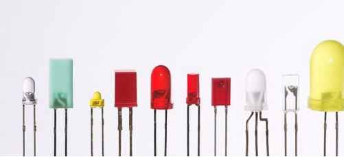

### Anoda a katoda LED

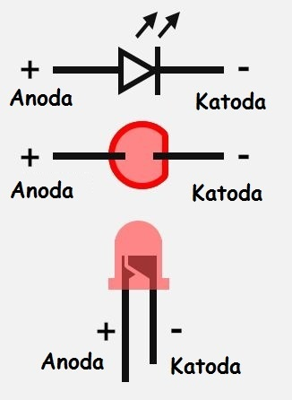

## 3\. Voltampérová charakteristika LED

Voltampérová charakteristika ukazuje, jak se mění proud LED při změně napětí. Do určitého napětí protéká jen velmi malý proud. Po dosažení propustného napětí začne proud rychle růst.

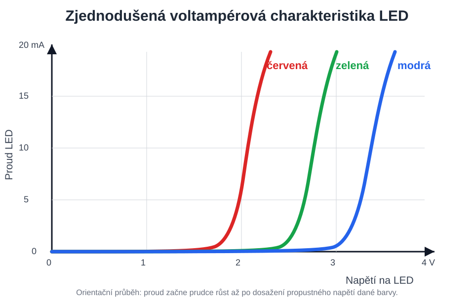

_Zjednodušené orientační porovnání. Červená LED se rozsvítí při nižším napětí než zelená a modrá LED._

### Podrobnější voltampérová charakteristika

Následující graf ukazuje také **závěrný směr**, tedy oblast záporného napětí, a orientační mezní hodnoty běžné indikační LED.

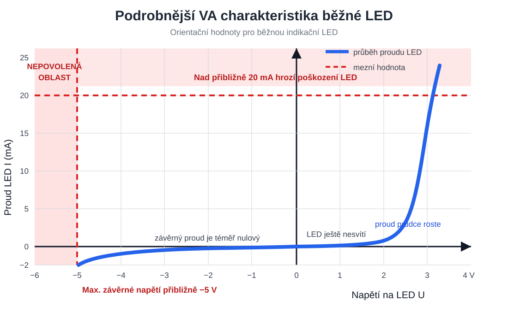

-   V propustném směru začne po dosažení propustného napětí proud velmi rychle růst.
-   LED není určena k běžnému provozu v závěrném směru.

## 4\. Napětí LED podle barvy

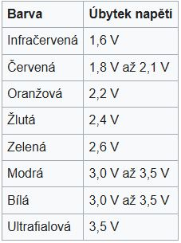

## 5\. Polovodičové materiály pro různé barvy LED

Barva LED závisí na použitém polovodičovém materiálu.

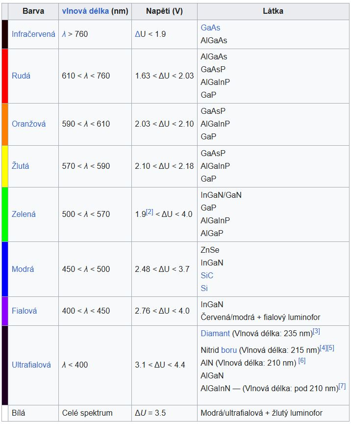
