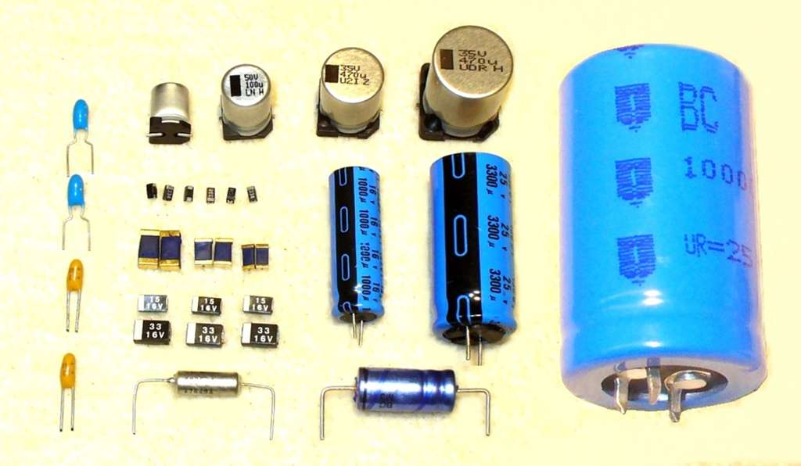
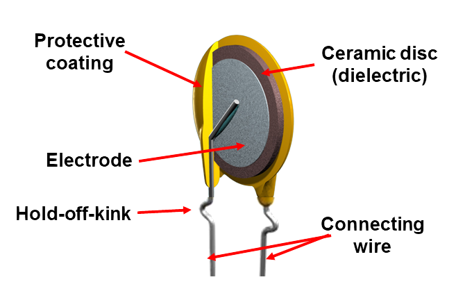

# Kondenzátory: elektrolytické a keramické

Kondenzátor **uchovává elektrický náboj** a používá se například k vyhlazení napětí, filtraci a oddělení stejnosměrné složky.

| Typ | Je orientovaný? | K čemu se používá | Co je uvnitř |
|---|---|---|---|
| **Elektrolytický** | **Ano** – má `+` a `−` pól | Velká kapacita, vyhlazování napájení | Dvě elektrody, oxidová izolační vrstva a elektrolyt |
| **Keramický** | **Ne** – nezáleží na směru zapojení | Odrušení a rychlé změny signálu | Dvě kovové elektrody oddělené keramickým dielektrikem |

### Kondenzátory

### Keramický kondenzátor

