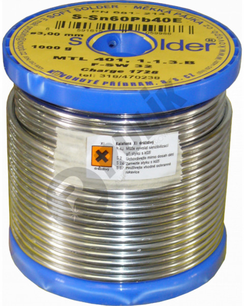
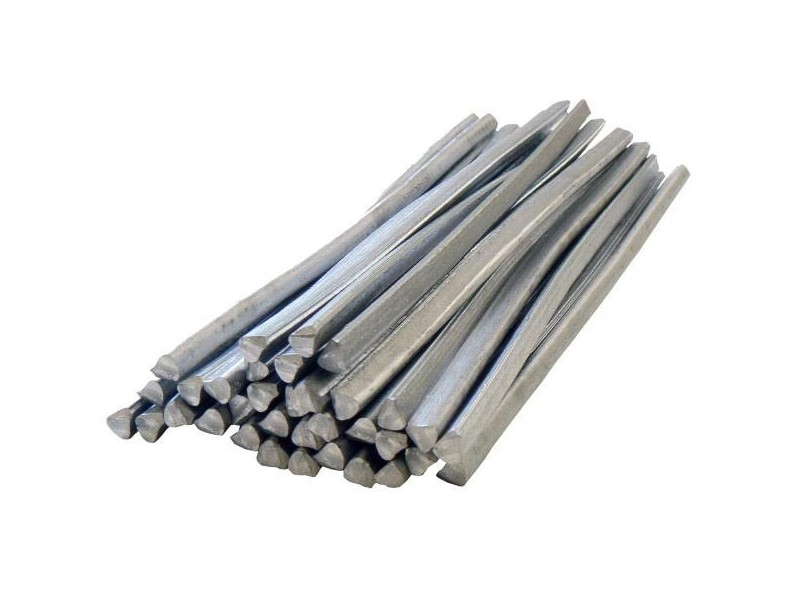
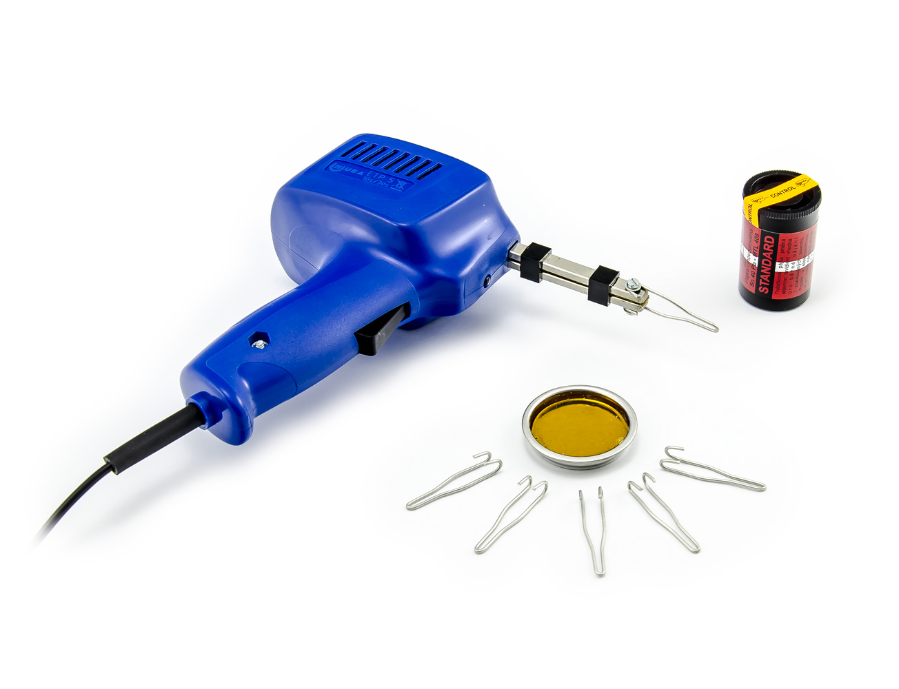
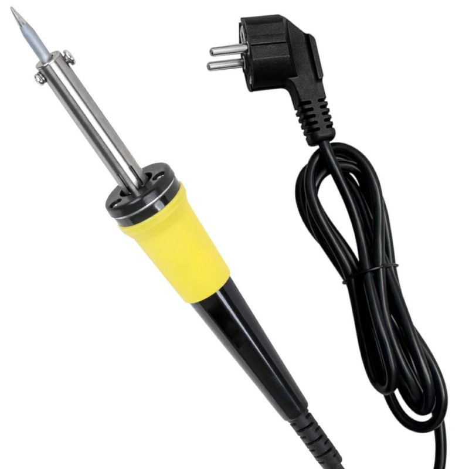
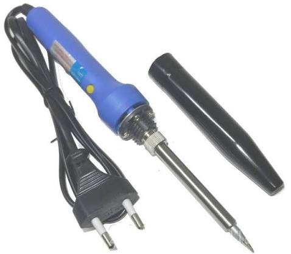
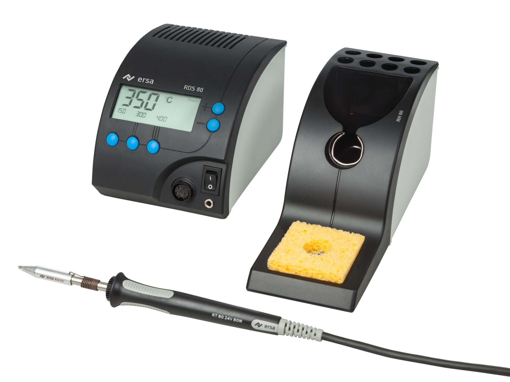
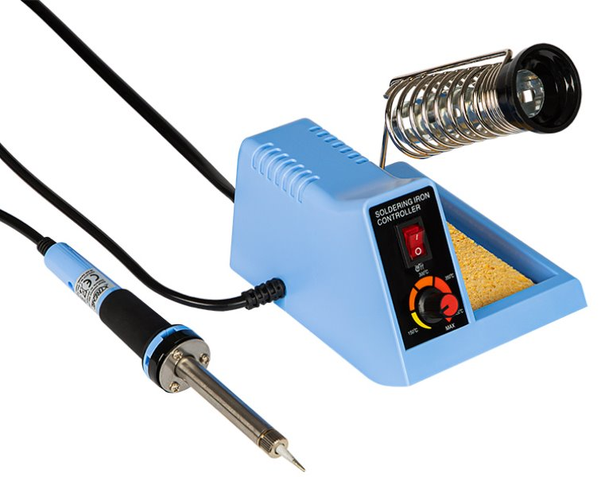
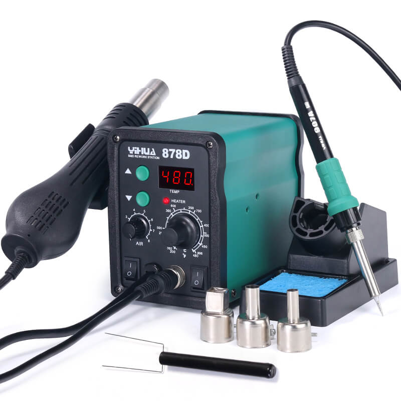
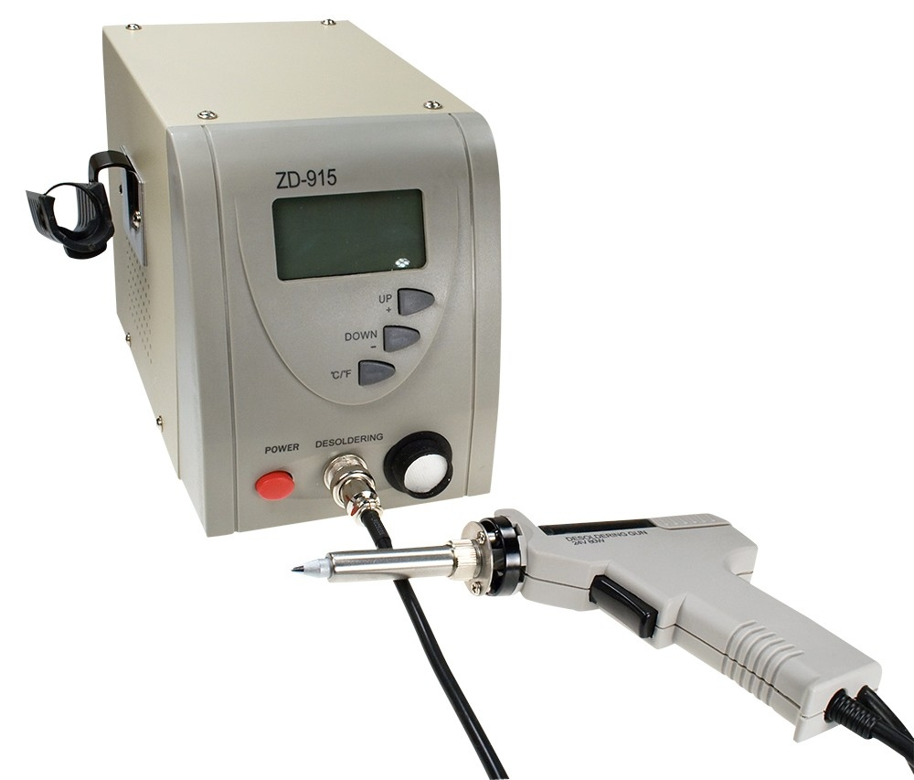

# Pájení

Pájení je spojování kovových dílů roztavenou **pájkou**. Základní materiál se při měkkém pájení obvykle netaví; pájka zateče do spoje a po ochlazení jej vodivě i mechanicky spojí. Před pájením je důležité povrchy očistit a použít vhodné tavidlo.

## Typy pájek podle složení

| Typ pájky | Běžné složení | Teplota tání / pracovní rozsah | Poznámka |
| --- | --- | --: | --- |
| Olovnatá | Sn60Pb40 | 190 | Tradiční univerzální pájka pro elektroniku. |
| Bezolovnatá SnCu | Sn99Cu1 | 220 | Levnější bezolovnatá varianta, méně vhodná pro jemnou práci než SAC. |
| Čistý cín | Sn100 | 240 | Používá se méně často; obvykle ve speciálních aplikacích. |

**Olovnaté pájky** se pájí snáze a při nižší teplotě, ale olovo je zdravotně i ekologicky závadné. **Bezolovnaté pájky** jsou dnes běžným standardem v nové elektronice; jejich vyšší teplota tání však více zatěžuje součástky a hroty páječek.

## Pájecí nástroje

-   **Trafopájka:** rychle se zahřeje, má smyčkový měděný hrot a hodí se hlavně na hrubší vodiče a krátké opravy. Pro citlivé součástky není ideální.

-   **Pájecí pero:** lehká ruční páječka s tenkým hrotem. Je vhodná pro běžné pájení vodičů, konektorů a elektronických součástek.

-   **Pájecí stanice:** zařízení s regulací teploty a odkládacím stojánkem. Umožňuje přesnější a bezpečnější práci, zejména s bezolovnatou pájkou.

-   **Servisní stanice:** rozšířená stanice pro opravy elektroniky. Často kombinuje pájecí hrot, horkovzdušnou pistoli, odsávání cínu nebo další funkce pro práci se součástkami SMD.

-     **Odsavačka**
