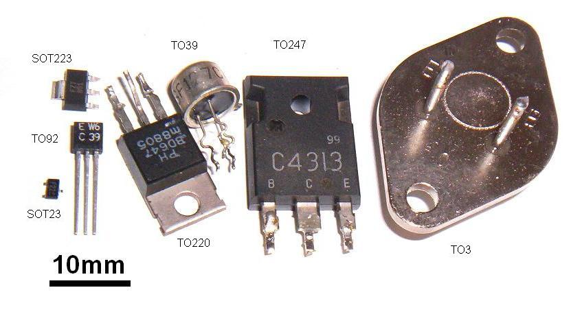
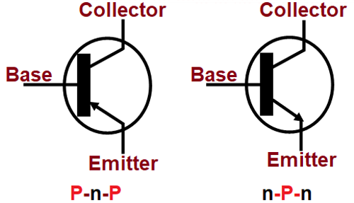
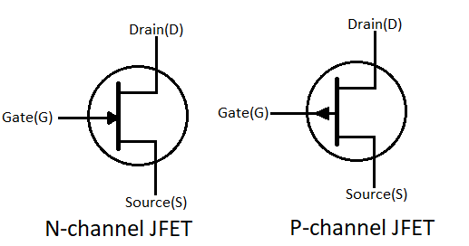
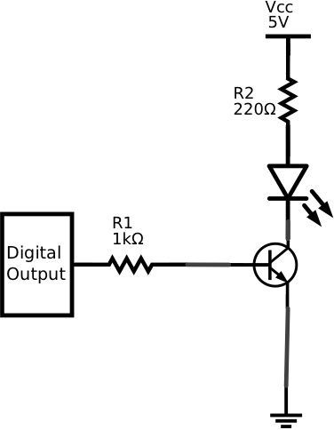

# Tranzistory – stručný a názorný přehled

Tranzistor je polovodičová součástka, která umí **zesilovat signál** nebo fungovat jako **elektronický spínač**. Má tři vývody a malým řídicím signálem ovládá větší proud.

## Jak se tranzistory dělí

```text
TRanzistory
├── Bipolární (BJT)
│    ├── NPN
│    └── PNP
└── Unipolární (FET)
     ├── N-kanál
     └── P-kanál
```
## Skutečné součástky

Tranzistory mohou vypadat jako malé plastové součástky pro desku plošných spojů nebo jako větší výkonová pouzdra s kovovou ploškou pro chlazení.



> Pozor: pořadí vývodů (např. E-B-C nebo G-D-S) se liší podle konkrétního typu. Vždy ověřte katalogový list.

## Bipolární tranzistory: 

BJT má vývody:

- **B – báze**: řídicí vývod,
- **C – kolektor**: vývod hlavního proudu,
- **E – emitor**: vývod hlavního proudu.



## Unipolární tranzistory:

FET má vývody:

- **G – gate (hradlo)**: řídicí elektroda,
- **D – drain (drain/kolektor)**,
- **S – source (source/zdroj)**.



## Základní princip na NPN: spínání LED

NPN tranzistor pracuje jako elektronický spínač:

1. **Řídicí signál = 0 V** → báze nemá proud → tranzistor je vypnutý → LED nesvítí.
2. **Řídicí signál = 5 V** → přes rezistor teče malý proud do báze → tranzistor se sepne.
3. Proud teče z napájení přes rezistor a LED, dále kolektorem a emitorem do země → LED svítí.


